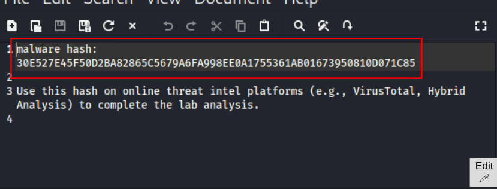
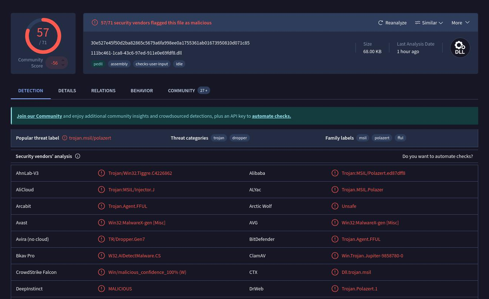
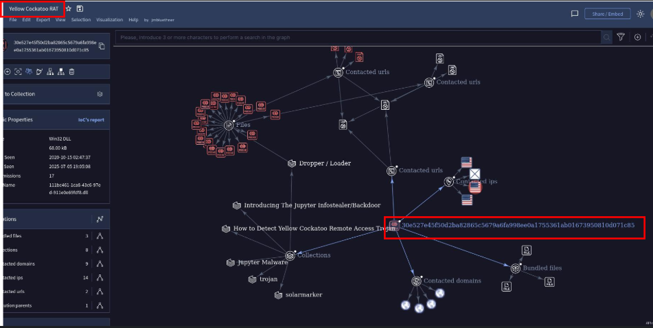
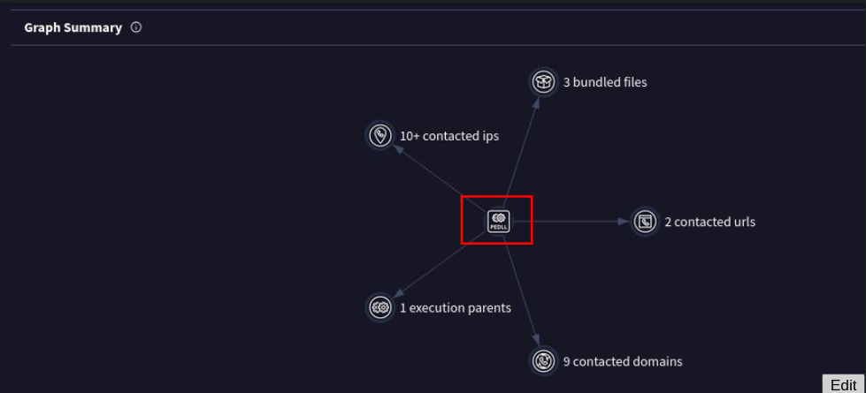
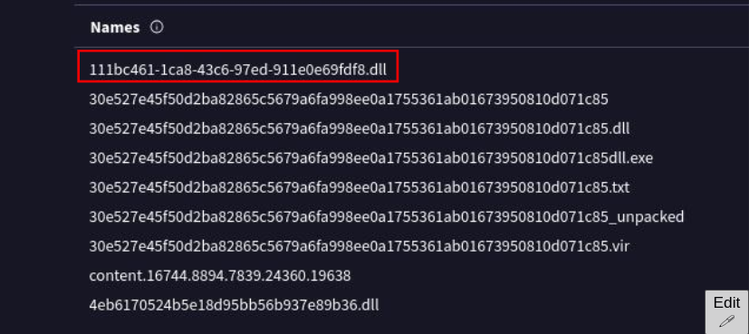
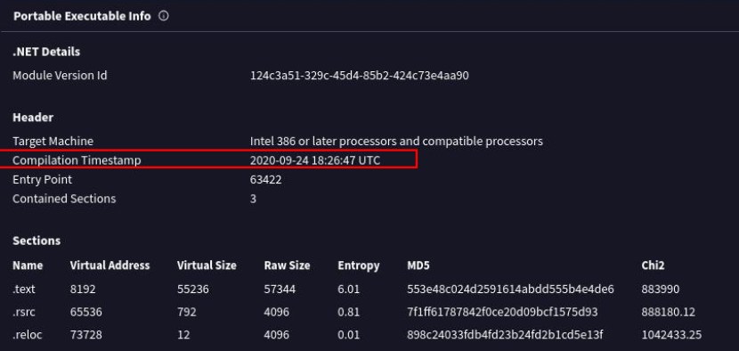
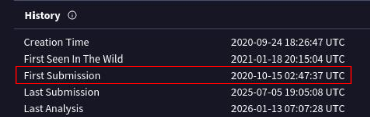
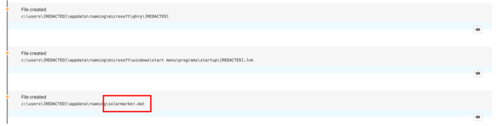
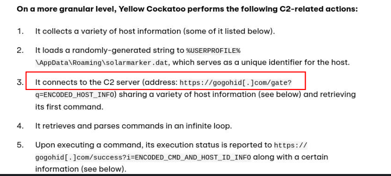

## Scenario

***
## Questions

- `30E527E45F50D2BA82865C5679A6FA998EE0A1755361AB01673950810D071C85`

- name of the malware family that causes abnormal network traffic

https://redcanary.com/blog/threat-intelligence/yellow-cockatoo/

- i was expecting IOCs in article but nope

- othewise in `relation` tab

- click on that it will lead to same
- in `details` tab

- compilation timestamp of the malware

- When was the malware first submitted to VirusTotal

- name of the `.dat` file that the malware dropped in the AppData folder
- read red canary article

-  C2 server that the malware is communicating with?

