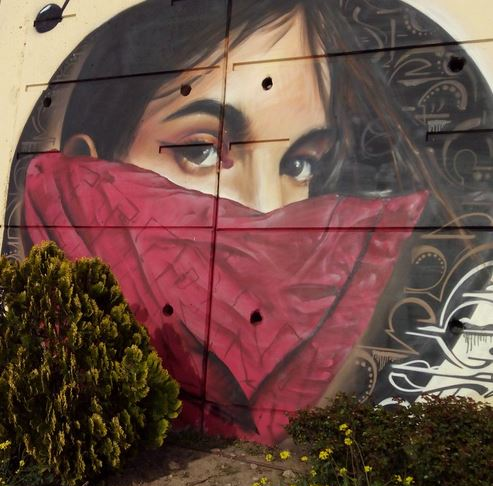
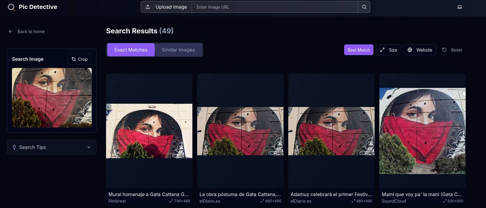
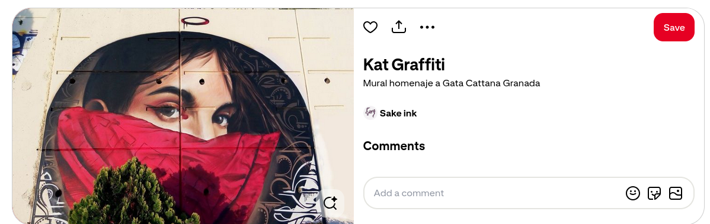
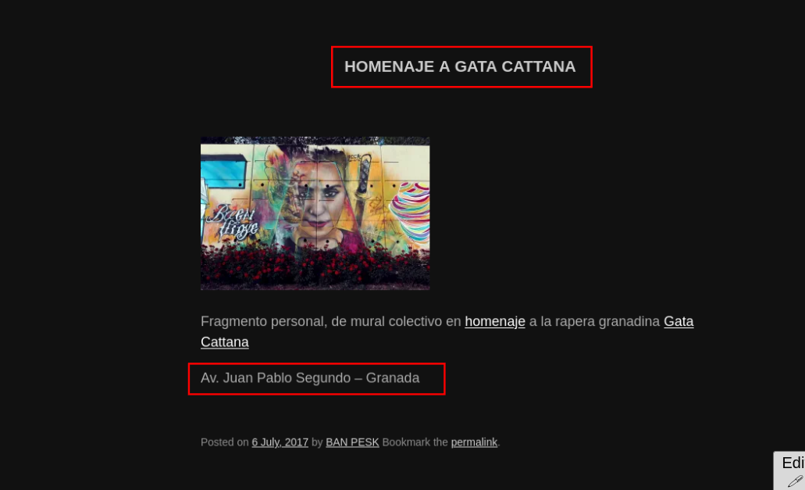
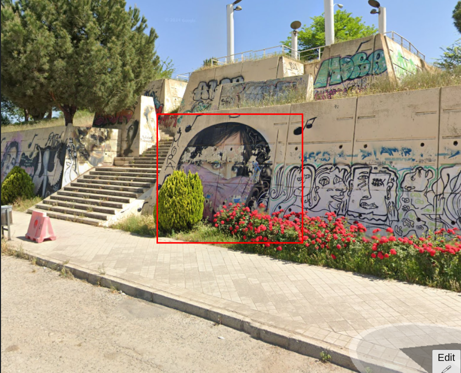
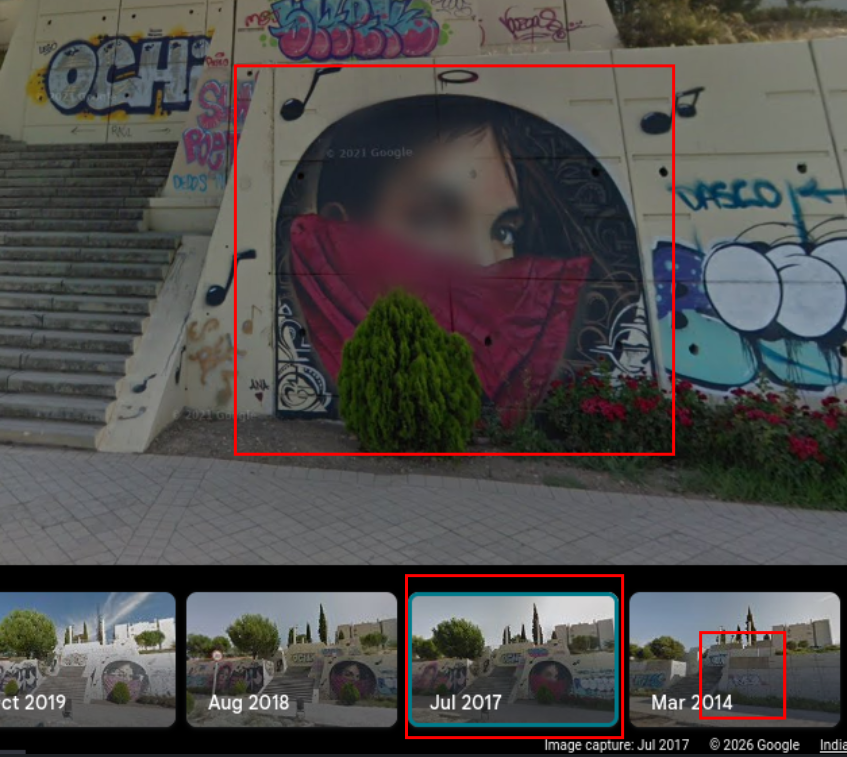
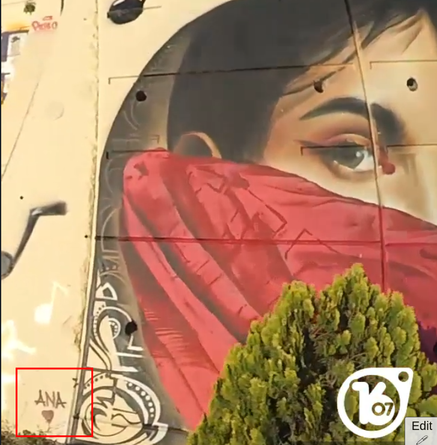
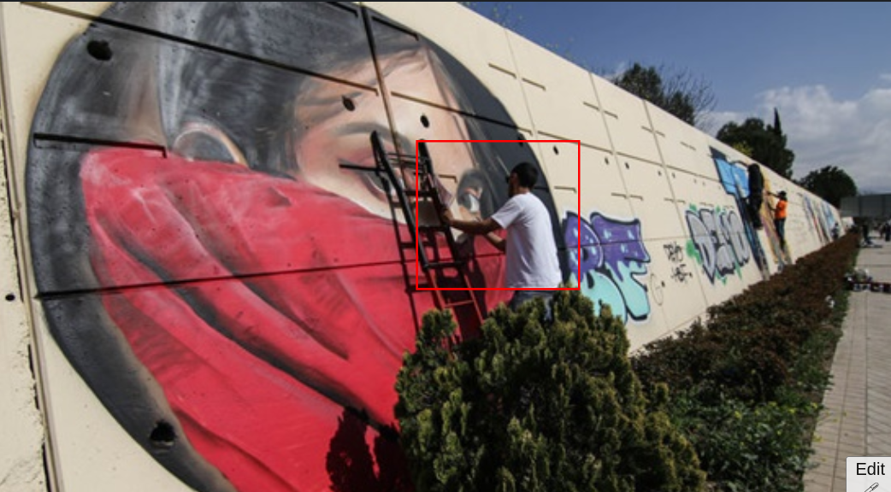
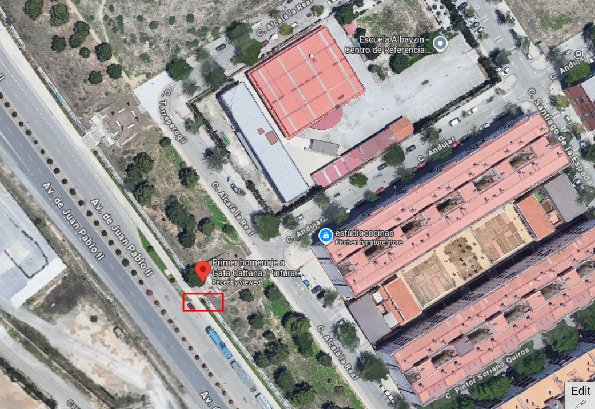
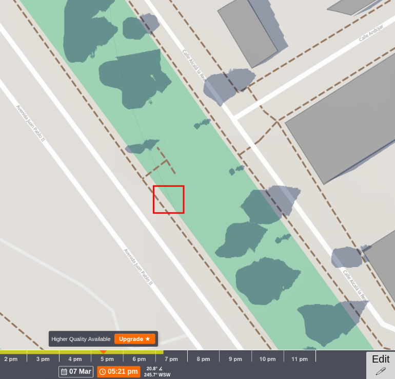

Who is she?

Flag format: HMV{namelastname}

Ex: HMV{johnwick}

***

use any image reverse site
- https://picdetective.com
- https://tineye.com/
- https://images.google.com/
- https://yandex.com/images/search

- https://www.insonoro.com/noticia/57213/homenaje-a-gata-cattana-con-una-exhibicion-de-grafitis-en-la-ciudad-de-granada

- found spanish article
- granada city paid tribute to passed away singer Gata Cattana
> HMV{GataCattana}

- to dig bit deeper i wanted to find exact coordinate of mural
- i stumbled upon this site
- https://peskpesk.com/gata-catana-23/

- upon walking bit on street view

> coordinates: 37.207969337342355, -3.620627541034744

- i also wanted to know time when mural was painted and by whom

- i found yt video in same spanish article

- on  site image name was `20170324-gata2.jpg`
- exiftool does not reveal anything
- which means 24 march 2017
- using shadow map we can estimate when this artist was painting mural

- red marks location of mural
- shade is in side of wall

- so it should be around 4 pm - 6 pm in evening 
