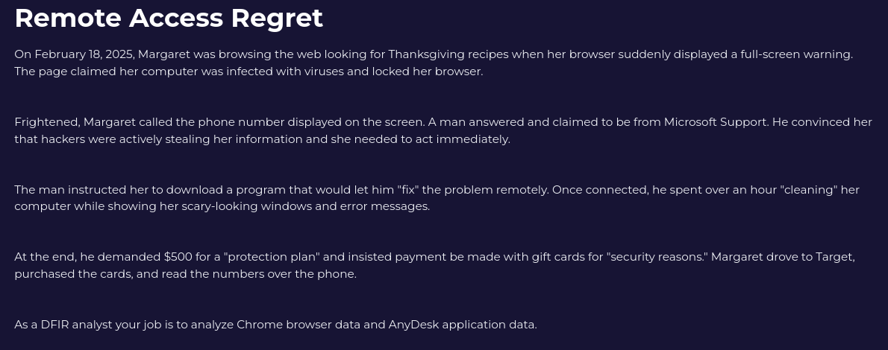
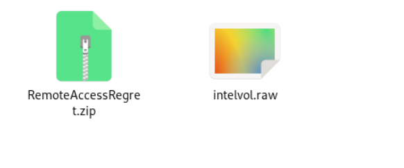
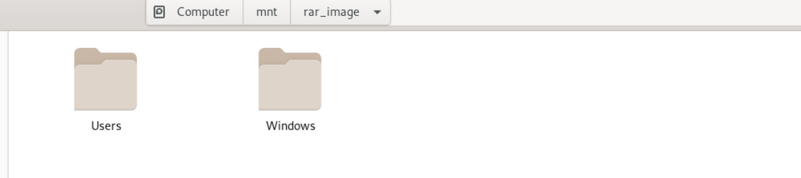
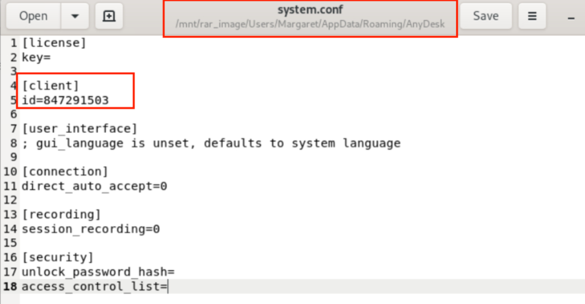
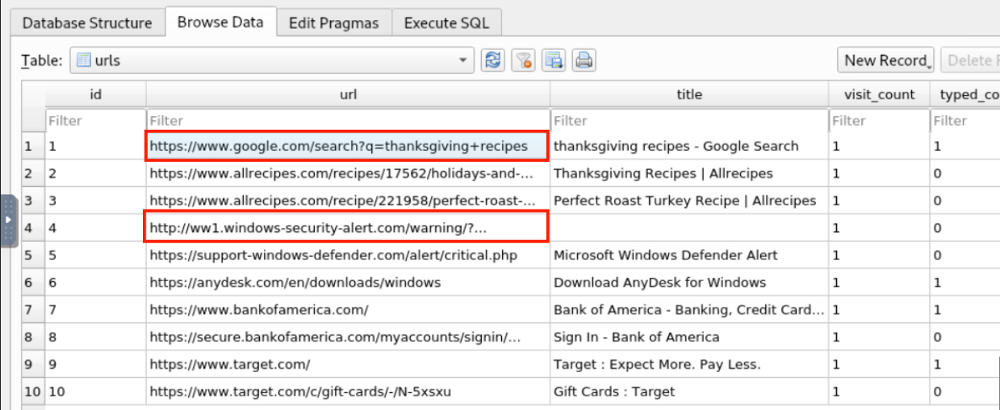
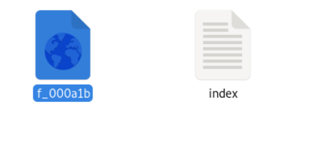
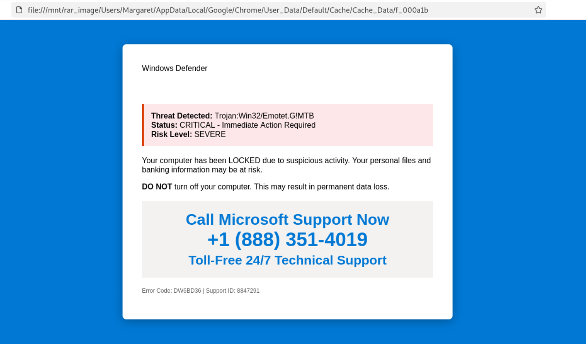
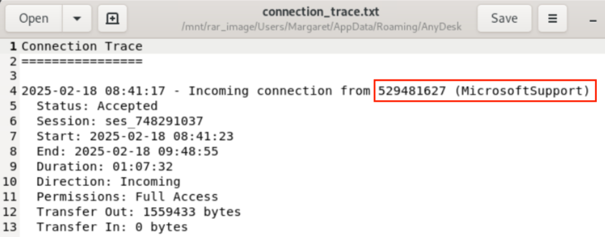
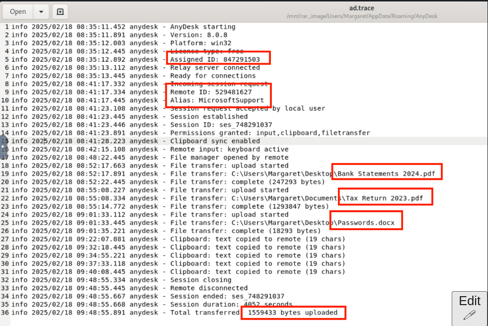

- scenerio






we get raw file 
- extract this using
```
dd if=intelvol.raw of=output.img bs=512
sudo mkdir /mnt/rar_image
sudo mount -o loop output.img /mnt/rar_image
```



-  local AnyDesk ID



- open this file in db browser


-  first website Margaret visited before encountering the scam

-  domain of the initial malicious redirect that led Margaret to the scam page




-   Examining the cached HTML file, what phone number was displayed to the victim



-    AnyDesk ID of the remote machine
-  alias of scammer


-  total session duration in seconds
-  convert hourly duration to second 4052 sec
-   first file stolen from Margaret's Desktop
-   How many bytes total exfiltrated


-    total URLs were visited during the browsing session on the day of the incident


- it is 10
---
