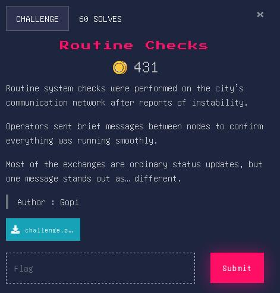
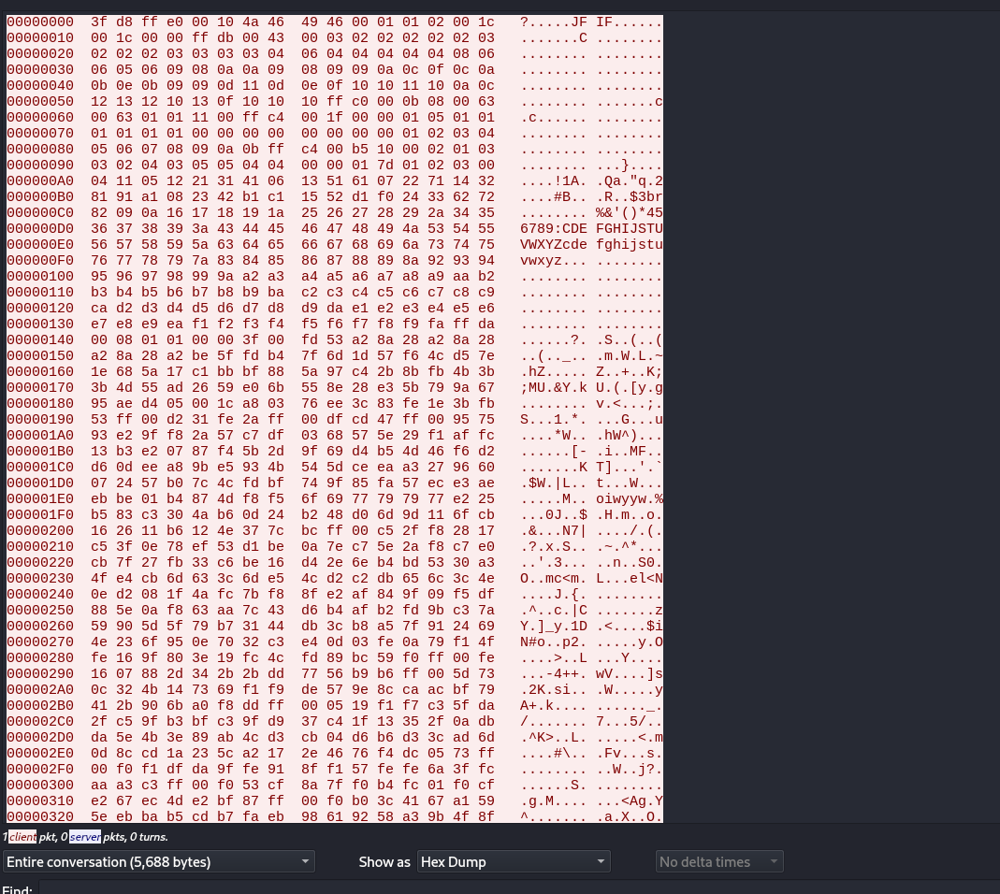
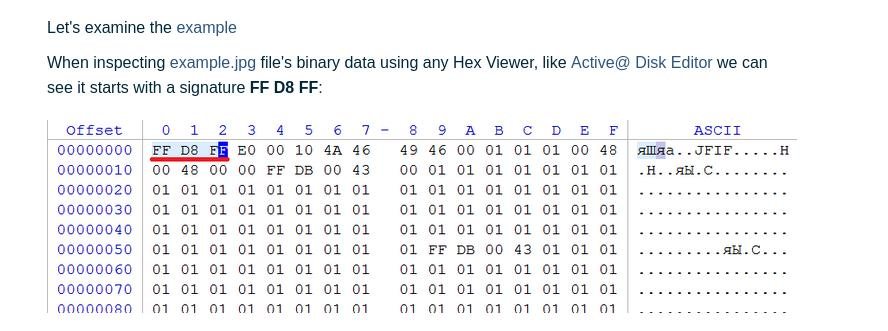

- download pcap file
- follow tcp stream
- contain jpg file but it is corrupt





- https://www.file-recovery.com/jpg-signature-format.htm



- using any hex editor change 3f to ff as jpeg JFIF header 

- save this dump in dump.txt
```
awk '{for(i=2;i<=17;i++) printf $i} END{print ""}' dump.txt | xxd -r -p > recovered.jpg
```
- gives this qr


- apporvctf{this_aint_it_brother}
- dead end
- we are onto it
```
$ steghide extract -sf recovered.jpg
Enter passphrase: 
wrote extracted data to "realflag.txt".
$ cat realflag.txt       
apoorvctf{b1ts_wh1sp3r_1n_th3_l0w3st_b1t}
```

